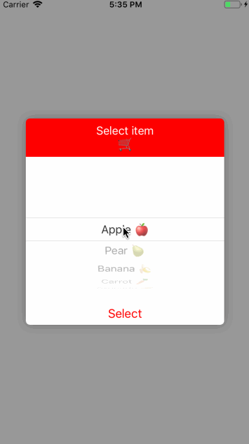

# PickerAlertController

PickerAlertController was created when I searched for a simple Alert styled view with UIPickerView. As UIAlertViewController is intended to be used as-is, the only way was to design a custom UIAlertView. I found many open source libraries which provide easily customizable Alerts, but they contained a lot of additional functionality for different UI elements which I did not need and I did not want to add any unnecesary lines of code to my project. So I decided to create my own PickerAlertController, which contains only the simple UIPickerView. You can use this as an inspiration for your own alert with UIPIckerView. :)  

Screenshots
----------------------

Alert is dismissed when tapping on the background. Used delegate pattern to handle selection and display the item on the screen.

